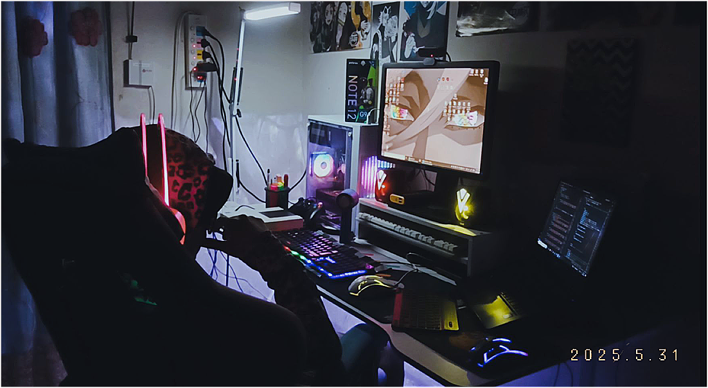

  

     Hello there!, I’m **Christian**, a versatile developer blending creativity with problem-solving to deliver innovative solutions.  
Experienced in front-end development, machine learning, and game development, I build purposeful projects while continuously advancing my skills.

<h5 align="left">Languages and Tools:</h5>

<!-- Core Web (Vanilla development) -->

<!-- Frontend Framework -->

<!-- Programming Languages -->

<!-- Machine Learning / AI Frameworks -->

<!-- Computer Vision -->

<!-- Game Development / 3D Design -->

<!-- Design Tools -->

  

  

    
  

  

    
  

