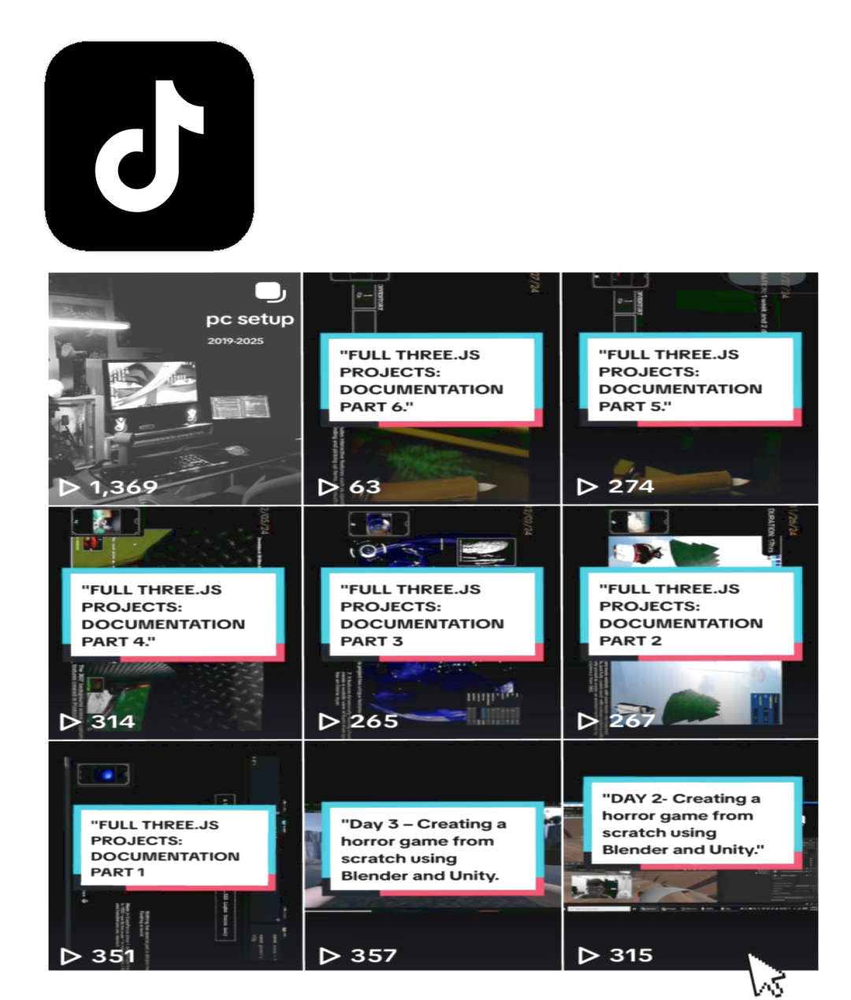

  

     Hello there!, I’m **Christian**, a versatile developer blending creativity with problem-solving to deliver innovative solutions.  
Experienced in front-end development, machine learning, and game development, I build purposeful projects while continuously advancing my skills.

<h5><strong>🛠️ Languages & Tools --> </strong></h5>

<table align="center">
  <tr>
    <!-- Frontend Core: HTML, CSS, JavaScript -->
    <td align="center">
      
    </td>
    <td align="center">
      
    </td>
    <td align="center">
      
    </td>
    <!-- Frontend Framework -->
    <td align="center">
      
    </td>
    <!-- Programming Languages -->
    <td align="center">
      
    </td>
    <td align="center">
      
    </td>
  </tr>
  <tr>
    <!-- Programming Languages continued -->
    <td align="center">
      
    </td>
    <!-- Machine Learning / AI -->
    <td align="center">
      
    </td>
    <td align="center">
      
    </td>
    <!-- Computer Vision -->
    <td align="center">
      
    </td>
    <!-- Design Tools -->
    <td align="center">
      
    </td>
    <td align="center">
      
    </td>
    <td align="center">
      
    </td>
  </tr>
</table>

<h5>📊 Others --> </h5>
 

<table align="center">
  <tr>
    <td>
      
    </td>
    <td>
      
    </td>
    <td>
      
    </td>
  </tr>
</table>

<h5>📊 Others --> </strong></h5>
 

<table align="center">
  <tr>
    <td>
      
    </td>
    <td>
      
    </td>
    <td>
          
    </td>
  </tr>
</table>

