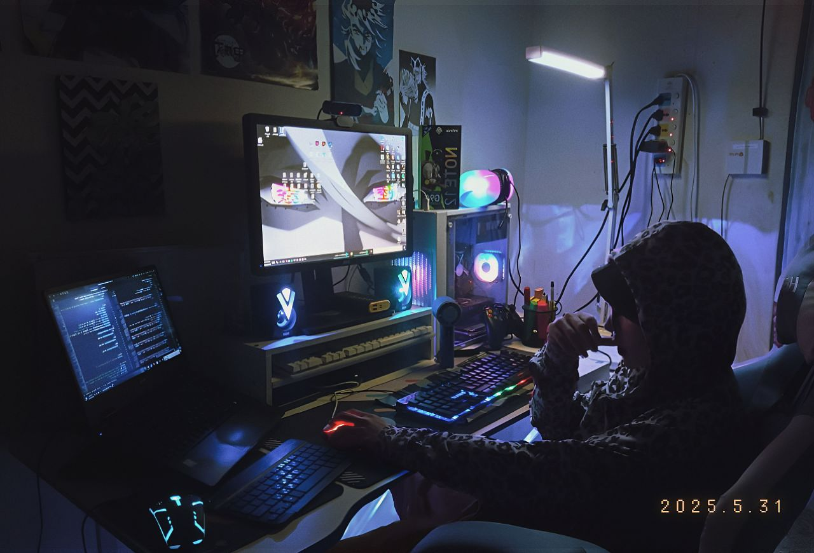

  

𝖨’𝗆 𝖺 𝗏𝖾𝗋𝗌𝖺𝗍𝗂𝗅𝖾 𝖽𝖾𝗏𝖾𝗅𝗈𝗉𝖾𝗋 𝖻𝗅𝖾𝗇𝖽𝗂𝗇𝗀 𝖼𝗋𝖾𝖺𝗍𝗂𝗏𝗂𝗍𝗒 𝗐𝗂𝗍𝗁 𝗉𝗋𝗈𝖻𝗅𝖾𝗆-𝗌𝗈𝗅𝗏𝗂𝗇𝗀 𝗍𝗈 𝖽𝖾𝗅𝗂𝗏𝖾𝗋 𝗂𝗇𝗇𝗈𝗏𝖺𝗍𝗂𝗏𝖾 𝗌𝗈𝗅𝗎𝗍𝗂𝗈𝗇𝗌. 𝖶𝗂𝗍𝗁 𝖾𝗑𝗉𝖾𝗋𝗂𝖾𝗇𝖼𝖾 𝗂𝗇 𝖿𝗋𝗈𝗇𝗍-𝖾𝗇𝖽 𝖽𝖾𝗏𝖾𝗅𝗈𝗉𝗆𝖾𝗇𝗍, 𝗆𝖺𝖼𝗁𝗂𝗇𝖾 𝗅𝖾𝖺𝗋𝗇𝗂𝗇𝗀, 𝖺𝗇𝖽 𝗀𝖺𝗆𝖾 𝖽𝖾𝗏𝖾𝗅𝗈𝗉𝗆𝖾𝗇𝗍, 𝖨 𝖼𝗋𝖾𝖺𝗍𝖾 𝗉𝗎𝗋𝗉𝗈𝗌𝖾𝖿𝗎𝗅 𝗉𝗋𝗈𝗃𝖾𝖼𝗍𝗌 𝗐𝗁𝗂𝗅𝖾 𝖼𝗈𝗇𝗍𝗂𝗇𝗎𝗈𝗎𝗌𝗅𝗒 𝖺𝖽𝗏𝖺𝗇𝖼𝗂𝗇𝗀 𝗆𝗒 𝗌𝗄𝗂𝗅𝗅𝗌.

I’m a versatile developer blending creativity with problem-solving to deliver innovative solutions. With experience in front-end development, machine learning, and game development, I create purposeful projects while continuously advancing my skills.

<h3 align="left">Languages and Tools:</h3>

<!-- Core Web (Vanilla development) -->

<!-- Frontend Framework -->

<!-- Programming Languages -->

<!-- Machine Learning / AI Frameworks -->

<!-- Computer Vision -->

<!-- Game Development / 3D Design -->

<!-- Design Tools -->

  

 
    

<h5 align="left">Explore My Documentation Platform:</h5>

  

